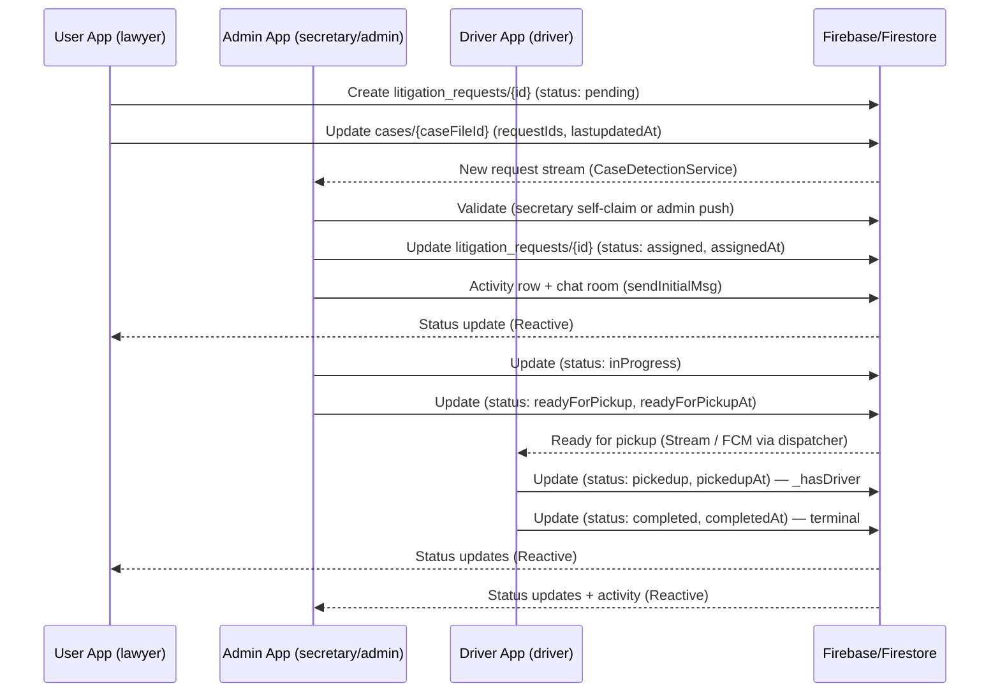
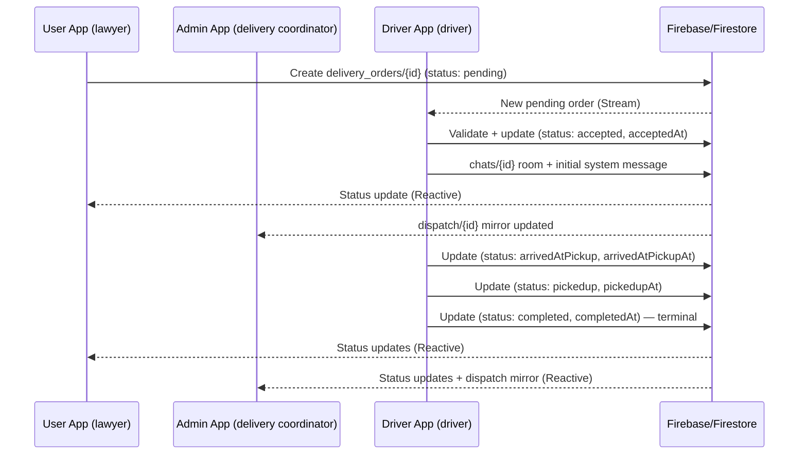
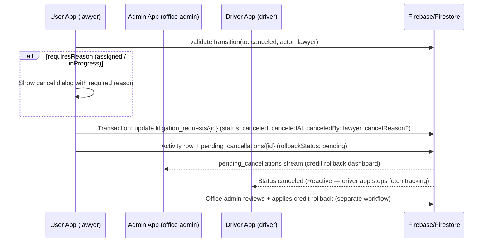
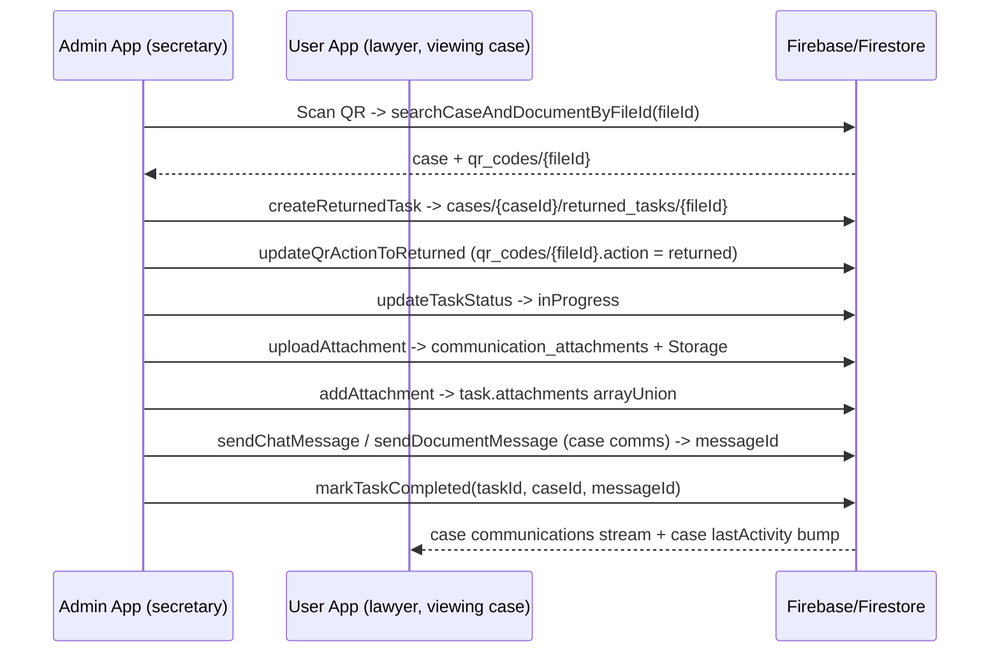

# FastCorr — Requests Flow, State Machine, Returned Tasks, Cases & Communications

> Single, comprehensive reference for how a **request** is born, moves through the
> system, terminates, and how every adjacent module (state machine, returned tasks,
> cases, case comms, request-level comms) plugs into it across the **user**,
> **admin**, and **driver** apps.
>
> Source of truth lives in `fastcorr_shared` so all three apps see one set of rules,
> models, and labels.

---

## Section 1 — Document Metadata

- **Package home:** `fastcorr_shared`
- **Consumers:** `fastcorr_user`, `fastcorr_admin`, `fastcorr_dr`
- **Date:** 2026-04-26
- **Owner:** FastCorr
- **Scope:** Requests lifecycle, state machine, returned tasks, case flow,
  case communications, and request-level (order) chat communications.

---

## Section 2 — High-Level Picture

FastCorr orchestrates two product flows under **one** status vocabulary and
**one** transition graph that lives in `fastcorr_shared`:

| Flow | `RequestFlow` | Primary Firestore collection | Driver of work |
|------|----------------|------------------------------|----------------|
| **Litigation** | `RequestFlow.litigation` | `litigation_requests/{orderId}` | Office admin / super admin assigns or secretary self-claims; client = lawyer |
| **Messenger**  | `RequestFlow.messenger`  | `delivery_orders/{orderId}`     | Driver self-accepts pending orders |

Both flows share the same `Status` enum (`fastcorr_shared/lib/models/request_model.dart`) and
both go through the **same** `RequestStateMachine`. The machine picks the
right subset of edges based on `RequestFlow`.

**Narrative lifecycles:**
- **Litigation:** `pending → assigned → inProgress → readyForPickup → pickedup → completed`
- **Messenger:**  `pending → accepted → arrivedAtPickup → pickedup → completed`

Both have side branches for `canceled`, `rejected`, `escalated`, `overdue`, plus
admin-driven recovery edges.

### Apps and their roles

- **`fastcorr_user`** — lawyers create requests, pay, track status, cancel
  before fulfilment, chat about delivery, and read case communications.
- **`fastcorr_admin`** — secretaries, correspondents, delivery coordinators,
  office admins, and super admins do the work, assign drivers/secretaries,
  cancel/escalate, run dashboards, manage case communications and returned tasks.
- **`fastcorr_dr`** — drivers accept messenger orders (or pickup litigation
  packages), update arrival/pickup, complete deliveries, and chat with
  lawyers/assignees.

---

## Section 3 — Core Data Layer

### 3.1 Collections

| Collection | Doc id | Purpose |
|------------|--------|---------|
| `litigation_requests/{orderId}` | request id | One litigation matter row; subcollection `activity/` for history |
| `delivery_orders/{orderId}` | order id | One messenger order row; subcollection `activity/` |
| `dispatch/{orderId}` | order id | Optional admin/driver dispatch mirror for messenger |
| `pending_cancellations/{orderId}` | order id | Lawyer-cancel snapshot awaiting office-admin credit-rollback decision |
| `cases/{caseId}` | case id | Matter (legal case file). Subcollections: `communications/`, `communication_attachments/`, `returned_tasks/` |
| `chats/{orderId}/messages/...` | order id | Order chat (logistics) — request-level communication |
| `secretary_case_assignments/{...}` | auto | Audit/log for case-to-secretary assignment |
| `staff/{uid}` | staff uid | Admin app user model |
| `drivers/{uid}` | driver uid | Driver account |
| `support_tickets/...` | ticket id | Help-desk channel — separate from case and order chat |
| `internal_chats/...` | various | Staff-only internal threads — separate from case/order chats |

### 3.2 Shared canonical models (`fastcorr_shared/lib/models/`)

- `request_model.dart` — `RequestModel` (litigation) + `Status`, `Priority`,
  `OrderType`, `ActionType`, timer enums.
- `order_model.dart` — `OrderModel` (messenger).
- `case_model.dart` — `CaseModel` (matter / case file).
- `unified_case_message.dart` — `UnifiedCaseMessage` for case communications,
  `DocumentAttachment`, `MessageStatus`, `UnifiedParticipantRole`,
  `UnifiedMessageType`.
- `chat_msg_model.dart` — `ChatMsgModel` for **order-level** (request-level) chat.

These are the shared contract; all three apps deserialize Firestore rows into
the same Dart shape.

---

## Section 4 — State Machine (`fastcorr_shared/lib/state/`)

This is the heart of the system: any status mutation in any app must pass
through here.

### 4.1 Files (entry points)

| Concern | Path |
|---------|------|
| Library barrel | `fastcorr_shared/lib/state/state.dart` |
| Validator (pure) | `fastcorr_shared/lib/state/request_state_machine.dart` |
| Transition table (single source of truth) | `fastcorr_shared/lib/state/transitions.dart` |
| Transition row schema | `fastcorr_shared/lib/state/transition.dart` |
| Validation outcome (sealed) | `fastcorr_shared/lib/state/transition_result.dart` |
| Stateful subject contract | `fastcorr_shared/lib/state/stateful_request.dart` |
| Litigation adapter | `fastcorr_shared/lib/state/adapters/request_model_state.dart` |
| Messenger adapter | `fastcorr_shared/lib/state/adapters/order_model_state.dart` |
| Actors | `fastcorr_shared/lib/state/actor_role.dart` |
| Flow enum + `OrderType→RequestFlow` | `fastcorr_shared/lib/state/request_flow.dart` |
| Patch builders (Firestore shape) | `fastcorr_shared/lib/state/request_status_patch.dart` |
| Lawyer-cancel payload (rollback queue) | `fastcorr_shared/lib/state/pending_cancellation_payload.dart` |

### 4.2 Design principles

1. **Validator, not mutator.** `RequestStateMachine` never writes to Firestore.
   It returns a `TransitionResult` (a sealed type). The caller (admin
   `RequestTransitionService` or shared transition clients) writes the patch.
2. **One row per legal edge.** Each `Transition` in `allowedTransitions` answers:
   from-status, to-status, which `flows`, which `actors`, optional reason
   requirement, optional precondition, server timestamp field name, and the
   declarative `notifies` (which `ActorRole`s should be pinged).
3. **App-agnostic actors.** `ActorRole` is a shared enum. Each app maps its own
   role (`StaffRole`, lawyer-uid, driver-uid, system) to an `ActorRole` before
   calling the machine.
4. **Subject adaptation, not inheritance.** `RequestModel` (litigation) and
   `OrderModel` (messenger) implement `StatefulRequest` only via thin adapters
   in `state/adapters/`. Models stay free of state-machine concerns.

### 4.3 Public API (`RequestStateMachine`)

```dart
// Pure/static APIs — no I/O.
static List<Status> statusesAppearingInFlow(RequestFlow flow);
static Set<Status> legalNextStates({required StatefulRequest subject, required ActorRole actor});
static bool canTransition({required StatefulRequest subject, required Status to, required ActorRole actor});
static TransitionResult validateTransition({
  required StatefulRequest subject,
  required Status to,
  required ActorRole actor,
  String? reason,
});
```

`validateTransition` resolution order (first failure wins):

1. `TerminalState` — current status is `completed | canceled | rejected`.
2. `IllegalTransition` — `(from, to, flow)` is not in the table.
3. `ForbiddenActor` — flow row exists, but the actor is not in `actors`.
4. `MissingReason` — row requires a reason but none was supplied.
5. `PreconditionFailed` — dynamic guard returns false (e.g. `_hasDriver`).
6. `TransitionAllowed(transition)` — the matched row is returned.

### 4.4 The transition table (selected highlights)

The full table lives in `transitions.dart`. Below is the policy summary you
need to keep in mind:

- **Entry:** litigation `pending → assigned` by `officeAdmin`, `superAdmin`, or
  `secretary` (self-claim). Messenger `pending → accepted` by `driver`.
- **Lawyer pending-cancel:** `pending → canceled` by `lawyer | officeAdmin |
  superAdmin` for both flows. No reason required (nothing started). Lawyer
  cancel additionally writes `pending_cancellations/{orderId}` for office-admin
  credit-rollback review.
- **Litigation work progression:** `assigned → inProgress`, `assigned →
  readyForPickup` (skip-ahead), `inProgress → readyForPickup`, all by
  `secretary`.
- **Litigation rejection:** `assigned → rejected` by `secretary`. Reason
  required (`rejectionReason`). After rejection, escalation is the path
  forward, not re-rejection.
- **Cancellation after work has started:** `assigned/inProgress → canceled` by
  lawyer or admin (reason required; `cancelReason`). `readyForPickup → canceled`
  is admin-only — past this point, refunds are an office decision and lawyers
  cannot self-cancel.
- **Driver pickup / arrival:**
  - Litigation: `readyForPickup → pickedup` (single hop) by `driver` —
    requires driver assigned (`_hasDriver`).
  - Messenger: `accepted → arrivedAtPickup → pickedup` (two hops) by `driver`.
- **Completion:** `pickedup → completed` by `driver` (both flows). Requires a
  driver. Multi-stop dropoff completion is left to the service layer because
  `StatefulRequest` does not carry per-dropoff progress.
- **Escalation:** `officeAdmin` or `system` may escalate from any non-terminal
  status; reason required (`escalationReason`). Auto path: `overdue →
  escalated`. Super admin is intentionally NOT in the actor set here — they
  must step into the office-admin role.
- **Overdue:** `system` only (Cloud Function flips status when `dueDate < now`).
  Overdue is a waypoint, not terminal.
- **Recovery (office admin only):** `escalated → assigned/inProgress/
  readyForPickup` (litigation), `escalated → pending` (messenger), and
  `escalated → canceled`. Reasons required (`recoveryReason` /
  `cancelReason`). Recovery never forward-skips stages.
- **Terminal states:** `completed`, `canceled`, `rejected`. No outgoing edges.

### 4.5 Patch builders (`request_status_patch.dart`)

After validation, the caller materializes the Firestore-side patch:

```dart
Map<String, dynamic> buildRequestStatusPatch({
  required Transition transition,
  required Status to,
  required ActorRole actor,
  String? reason,
});

Map<String, dynamic> buildDeliveryOrderStatusPatch({...});  // adds 'lastUpdated'
```

Patch shape:

- `status: to.name`
- `updatedAt: Timestamp.now()` (and `lastUpdated` for delivery orders)
- `[transition.timestampField]: now` if the row declares one
  (`assignedAt`, `acceptedAt`, `arrivedAtPickupAt`, `pickedupAt`, `completedAt`,
  `canceledAt`, `readyForPickupAt`)
- `[transition.reasonField]: reason` if `requiresReason && reason != null`
  (`cancelReason`, `rejectionReason`, `escalationReason`, `recoveryReason`)
- `canceledBy: actor.name` when `to == Status.canceled` (used by the office-
  admin dashboard to filter `canceledBy == lawyer` for credit rollback)

### 4.6 Validation contract — canonical caller code

```dart
final decision = RequestStateMachine.validateTransition(
  subject: RequestModelState(request),
  to: Status.readyForPickup,
  actor: ActorRole.secretary,
  reason: null,
);
if (decision is! TransitionAllowed) {
  throw StateError(decision.message);
}
final patch = buildRequestStatusPatch(
  transition: decision.transition,
  to: Status.readyForPickup,
  actor: ActorRole.secretary,
);
await firestore
    .collection('litigation_requests')
    .doc(orderId)
    .update(patch);
```

UI gating uses `legalNextStates(...)` to enable/disable buttons. The result is
the **upper bound**; preconditions are still re-checked at write time.

---

## Section 5 — Applying Transitions (Service Layer)

The state machine never writes. Three appliers consume its decisions and
perform the Firestore mutations.

### 5.1 Admin: `RequestTransitionService`

**File:** `fastcorr_admin/lib/services/request_transition_service.dart`

The most fully-featured applier. Used by admin staff actions.

- Two methods: `applyRequestStatusTransition` (litigation_requests) and
  `applyDeliveryOrderStatusTransition` (delivery_orders).
- Both run **inside a Firestore transaction** so re-read + validate + write
  is consistent against concurrent updates:
  1. `transaction.get(docRef)` to get a **fresh** snapshot.
  2. Build the right `StatefulRequest` adapter and call
     `RequestStateMachine.validateTransition(...)`.
  3. If not allowed, return the failure (no writes happen).
  4. If allowed:
     - `transaction.update(docRef, buildXxxStatusPatch(...) + mergeFields)`
     - `transaction.set(activityRef, ActivityModel(...).toJson())` —
       writes a row to the `activity/` subcollection.
     - If `actor == lawyer && to == canceled`, `transaction.set` to
       `pending_cancellations/{orderId}` using
       `buildLitigationPendingCancellationPayload` /
       `buildMessengerPendingCancellationPayload`.
     - For delivery orders, also call `MessengerDispatchMirror.applyInTransaction(...)`
       to keep `dispatch/{orderId}` in sync.
  5. After the transaction commits and if `dispatchNotifications`:
     - `_recipientResolver.resolve(...)` translates each
       `transition.notifies` `ActorRole` into actual user ids using
       request fields and `staff` queries; the actor themselves is
       excluded.
     - `_notificationDispatcher.dispatch(...)` (FCM/email) hits those users.

`mergeFields` lets call sites merge non-status fields atomically with the
same write (e.g. `notes` on completion). It must NOT clobber `status` or
`updatedAt` unless intentional.

### 5.2 Shared: `LitigationRequestTransitionClient` &nbsp;/&nbsp; `DeliveryOrderTransitionClient`

**Files:**

- `fastcorr_shared/lib/services/litigation_request_transition_client.dart`
- `fastcorr_shared/lib/services/delivery_order_transition_client.dart`

These are leaner appliers used by **user** and **driver** apps when those
apps must mutate state directly (lawyer cancel, driver pickup/arrival/
complete).

- Same transactional shape as admin (re-read, validate, write).
- Always write the `activity/` row in plain-map form.
- Lawyer cancel writes `pending_cancellations/{orderId}` automatically.
- Delivery order applier always calls `MessengerDispatchMirror`.
- Both expose an `alsoInTransaction` callback for callers to layer
  domain-specific writes atomically (e.g. driver app updating a QR doc on
  pickup).
- They do **not** dispatch notifications — that responsibility stays on the
  admin app or backend after the fact.

### 5.3 User: `UserOrderCancellationService`

**File:** `fastcorr_user/lib/services/user_order_cancellation_service.dart`

Lawyer-friendly facade used by `RequestDetailsViewModel` and similar.

- `canLawyerCancelLitigation(request)` — returns `true` iff
  `legalNextStates(subject, ActorRole.lawyer).contains(Status.canceled)`.
- `canLawyerCancelDelivery(order)` — same for messenger.
- `litigationCancelRequiresReason(request)` — `true` when status is
  `assigned` or `inProgress` (mirrors the transition table).
- `cancelLitigationRequest(...)` / `cancelDeliveryOrder(...)` delegate to the
  shared clients with `actor: ActorRole.lawyer`.

### 5.4 Notification recipient resolver

**File:** `fastcorr_admin/lib/services/notification_recipient_resolver.dart`

Translates declarative `Set<ActorRole>` from the matched transition into
concrete user ids:

| `ActorRole` | Resolution |
|-------------|------------|
| `lawyer` | `request.lawyerId` / `order.lawyerId` |
| `secretary`, `correspondent` | `request.assigneeId` / `order.assigneeId` |
| `driver` | `request.driverId` / `order.driverId` |
| `officeAdmin` | All `staff` with `userRole == office_admin` for `request.officeId` |
| `deliveryCoordinator` | All `staff` with `userRole == deliveryCoordinator` for that office |
| `superAdmin` | All super admins org-wide |
| `system` | Skipped (no user) |

The caller is excluded via `excludeUserId` so an actor never gets pinged
about their own action.

### 5.5 Messenger dispatch mirror

**File:** `fastcorr_shared/lib/services/messenger_dispatch_mirror.dart`

If `dispatch/{orderId}` exists (used by some delivery-coordinator views),
the mirror copies the relevant timestamps + `status` + `cancelReason` /
`rejectionReason` / `escalationReason` / `canceledBy` from the validated
patch into it inside the same transaction — so the dispatcher view never
shows stale state.

It defensively asserts `smPatch['status'] == expectedTo.name` to catch
programmer error (caller forgetting to use the patch builder).

### 5.6 Pending cancellations

**File:** `fastcorr_shared/lib/state/pending_cancellation_payload.dart`

When a lawyer cancels, the office admin must decide on credit rollback /
refund. The mirror doc shape:

```json
{
  "requestId": "LTGN…",
  "lawyerId": "uid",
  "officeId": "off1",
  "orgId": "org1",
  "orderType": "litigation" | "messenger",
  "snapshot": { "orderId": "...", "title": "...", "status": "...", ... },
  "cancelReason": "…or empty",
  "canceledAt": Timestamp,
  "rollbackStatus": "pending"
}
```

The admin office dashboard surfaces these with `rollbackStatus == 'pending'`
and `canceledBy == 'lawyer'` for triage. The actual rollback workflow is
**not** modelled by the state machine — it’s a separate financial workflow.

---

## Section 6 — Request Lifecycle (End-to-End Practical View)

### 6.1 Litigation flow — practical step-by-step

1. **Creation (user app).** Lawyer flows through checkout in
   `fastcorr_user` and `LitigationService.createNewRequest(...)` writes:
   - `litigation_requests/{orderId}` with `status: pending`.
   - `litigation_requests/{orderId}/activity/{auto}` "New Order Created".
   - `cases/{caseFileId}` is updated:
     `requestIds: arrayUnion([orderId])`, `lastupdatedAt`,
     `totalCost: increment(cost)`.
2. **Detection & assignment (admin app).** When the request stream
   delivers the new doc, `CaseDetectionService.processIncomingRequest` looks
   up `cases/{request.caseFileId}`. If `caseFile.assigneeId` is empty, it
   delegates to `CaseAssignmentService.assignCaseToSecretary(...)` (or load-
   balanced auto-assignment). If the case has an assignee, that secretary
   inherits this request.
3. **`pending → assigned`.** Office admin pushes (or secretary self-claims)
   via admin `TaskService` / `RequestTransitionService`. Patch sets `status:
   assigned`, `assignedAt`. `notifies` = `{lawyer, secretary}`.
4. **Working.** Secretary moves `assigned → inProgress` (no required reason).
   On a quick job, the table also allows `assigned → readyForPickup` skip-
   ahead. Both record `readyForPickupAt` when applicable.
5. **`readyForPickup`.** When secretary marks ready, `notifies` adds
   `deliveryCoordinator` so a driver can be dispatched.
6. **Pickup.** Driver claims the package; `readyForPickup → pickedup` requires
   `driverId` set (precondition `_hasDriver`).
7. **Completion.** Driver completes; `pickedup → completed`. `notifies` =
   `{lawyer, secretary, officeAdmin}`. **Terminal.**

### 6.2 Messenger flow — practical step-by-step

1. **Creation.** User-app delivery flow writes `delivery_orders/{orderId}`
   with `status: pending`.
2. **Acceptance.** Driver self-accepts in `fastcorr_dr`: `pending → accepted`,
   stamps `acceptedAt`, fires `notifies = {lawyer}`. Driver app also writes
   the initial system message into `chats/{orderId}` (see §10).
3. **Arrival.** `accepted → arrivedAtPickup` stamps `arrivedAtPickupAt`.
4. **Pickup.** `arrivedAtPickup → pickedup` stamps `pickedupAt`.
5. **Completion.** `pickedup → completed` stamps `completedAt`. Final
   system message goes into `chats/{orderId}`.

### 6.3 Side branches (both flows)

- **Lawyer cancel pending** — `pending → canceled`, no reason.
  `pending_cancellations/{orderId}` is written with `rollbackStatus: pending`.
- **Lawyer cancel after work started (litigation only, up to inProgress)** —
  reason is required.
- **Admin cancel after readyForPickup / accepted** — admin-only, reason
  required.
- **Rejection (litigation, secretary only at `assigned`)** — reason required.
- **Escalation** — admin or system from any non-terminal status; reason
  required. `overdue → escalated` is the system auto path.
- **Overdue** — system only, written when `dueDate < now`.
- **Recovery** — office admin only, e.g. `escalated → assigned`. Recovery
  always lands on the right pre-flagged status, never forward-skips.

### 6.4 ViewModel/UI gating

- `RequestStateMachine.legalNextStates(subject, actor)` populates buttons /
  dropdowns. UI-level guards (e.g. `canLawyerCancelCurrentRequest` in
  `fastcorr_user/lib/ui/views/request_details/request_details_viewmodel.dart`)
  call this directly.
- `litigationCancelRequiresReason(...)` decides whether the cancel dialog
  should require non-empty input.
- `Status.statusDisplayName` (in `request_model.dart`) provides the human
  label for every status — never spell statuses by hand in UI.

---

## Section 7 — Returned Tasks Module

### 7.1 What it is

A "returned task" represents a physical document that has been **returned**
to the office (by a court or opposition attorney) and now needs the
secretary to act on it (e.g. file a follow-up, scan, escalate). It lives
under the **case** that owns the document, not under any single request.

### 7.2 Data layout

| Path | Purpose |
|------|---------|
| `cases/{caseId}/returned_tasks/{taskId}` | The task document itself |
| `cases/{caseId}/communications/{...}` | The "completion" message linked back via `completedMessageId` |
| `organisations/{orgId}/qr_codes/{fileId}` | The QR-coded physical document; status flips to `returned` when intake happens |

### 7.3 Model (`fastcorr_admin/lib/models/returned_task_model.dart`)

`ReturnedTaskModel` fields of note:

- `id`, `caseId`, `litNumber` — chain-of-custody anchors.
- `orgId`, `officeId`, `assigneeId`, `createdBy` — for cross-office routing.
- `documentType`, `documentDescription`, `notes` — what came back.
- `source` — `ReturnedTaskSource.court | oppositionAttorney`.
- `priority` — `ReturnedTaskPriority.urgent (1 day)` or `standard (5 days)`.
- `receivedDate`, `dueDate`, `createdAt`, `updatedAt` — lifecycle timestamps.
- `status` — `ReturnedTaskStatus.pending | inProgress | completed | overdue`.
- `attachments` — list of `DocumentAttachment` ids in
  `cases/{caseId}/communication_attachments/...` (so it shares attachment
  storage with case comms).
- `completedMessageId` — the `cases/{caseId}/communications/{messageId}`
  that the secretary posted to confirm completion.
- `fileId` — links back to a QR document (e.g. `Lit1234-2324`).

Helpers: `isOverdue`, `isUrgent`, `daysUntilDue`, plus display-name getters.

### 7.4 Service (`fastcorr_admin/lib/services/returned_task_service.dart`)

Key methods:

- `createReturnedTask(task)` — writes to
  `cases/{caseId}/returned_tasks/{fileId}`. Doc id == `task.fileId` so
  re-intaking the same QR document is idempotent.
- `getReturnedTasksForSecretary(secretaryId, {officeId})` — collection-group
  query on `returned_tasks` filtered by `assigneeId` (and optionally
  `officeId`). Filters out `completed` in memory, sorts by `createdAt`.
- `getActiveReturnedTasksForCalendarForSecretary(...)` — same query but
  excludes `completed` regardless and sorts by `dueDate` (calendar/alerts).
- `getReturnedTasksForCase(caseId)` — per-case list, ordered by `createdAt`.
- `getReturnedTasksStreamForCase(caseId)` — real-time stream variant.
- `updateTaskStatus(taskId, caseId, status)` — bare status update.
- `markTaskCompleted(taskId, caseId, messageId)` — the **canonical** way to
  finish: status → `completed`, `completedMessageId = messageId` (linking the
  case comms message that proves it).
- `addAttachment` / `removeAttachment` — `arrayUnion` / `arrayRemove` of
  attachment ids.
- `getTaskStatisticsForSecretary(secretaryId)` — counts by status, source,
  overdue, urgent.
- **Chain of custody:** `searchCaseAndDocumentByFileId(fileId)` parses
  `Lit####-####`, finds the case (`cases.where('litNumber', isEqualTo:
  litNumber)`), then resolves
  `organisations/{orgId}/qr_codes/{fileId}` to confirm the QR document
  exists. Both must exist or it throws.
- `updateQrActionToReturned({orgId, fileId})` flips the QR doc’s `action`
  to `returned` once intake is complete.

### 7.5 Practical UX flow

1. **Intake (admin desktop / scanner).** Secretary scans the QR on the
   physical document; `searchCaseAndDocumentByFileId` returns the case and
   QR doc. Secretary fills source/priority/notes; `createReturnedTask` writes
   the task; `updateQrActionToReturned` flips the QR doc’s action.
2. **Triage.** Secretaries see their queue via
   `getReturnedTasksForSecretary` (inbox at
   `fastcorr_admin/lib/ui/views/secretary_dashboard/returned_tasks_inbox_view.dart`)
   and per-case lists via the case-details "Returned tasks" tab
   (`returned_tasks_tab_model.dart`). Counts come from helper getters
   (`overdueTasksCount`, `pendingTasksCount`, etc.).
3. **Working.** Secretary moves the task to `inProgress`, can attach files
   (which are uploaded into `cases/{caseId}/communication_attachments` and
   the id is appended to `attachments` on the task).
4. **Completion.** Secretary writes a case-comms message describing the
   resolution; the message id is then passed to `markTaskCompleted` so the
   audit trail lives in `cases/{caseId}/communications` (one place to look
   for "what happened on the matter") and the task points back to it via
   `completedMessageId`.
5. **Calendar / alerts.** The "active" calendar query is sorted by
   `dueDate`. `isOverdue` short-circuits when `now > dueDate && status !=
   completed`.

### 7.6 Why this design

- Returned-task UX is per-secretary, but the **artefact** belongs to a case,
  so storage is per-case. The collection-group query on `returned_tasks`
  gives the per-secretary inbox without duplicating data.
- Linking completion to a real case-comms message means audit history is in
  one place rather than a parallel "task notes" buffer.
- Sharing attachment storage with case comms means a returned-task file is
  also visible in the matter thread, no double-upload.

---

## Section 8 — Case Flow

### 8.1 What the case is

A `cases/{caseId}` document represents a **legal matter**. A matter can
have many requests (litigation tasks) attached via `requestIds`, plus
delivery orders that link via `OrderModel.caseFileId`. A case has exactly
one `assigneeId` (the secretary running the case) and tracks `phase` as
the legal stage progresses.

### 8.2 Practical lifecycle

1. **Case creation.** Cases are typically created as a side-effect of the
   first litigation request, or can be created up-front by office admins.
   `cases/{caseId}.requestIds` is filled in by `LitigationService.createNewRequest`.
2. **Case detection on incoming requests.**
   `fastcorr_admin/lib/services/case_detection_service.dart`'s
   `processIncomingRequest(request)` runs whenever the admin sees a new
   request:
   - Resolves `cases/{request.caseFileId}`.
   - If `caseFile.shouldUpdatePhase(request.phase)`, calls `updateCasePhase`.
   - If the case has no assignee, kicks off case assignment.
3. **Case assignment.** `CaseAssignmentService.assignCaseToSecretary(...)`
   - Validates the secretary is active and has `StaffRole.secretary`.
   - Writes `cases/{caseId}.assigneeId` and a row in
     `secretary_case_assignments/`.
   - Logs an activity row via `ActivityLogService`.
   - Auto-assignment is delegated to
     `LoadBalancingAssignmentService` when the office wants round-robin.
4. **Case state sync (cross-app).** When phase or assignment changes,
   `fastcorr_shared/lib/services/unified_case_state_sync_service.dart` writes
   to `case_state_sync_logs` and `cross_app_notifications` so both user-app
   and admin-app surfaces stay in sync.
5. **Case Details UI (admin).** `case_details_viewmodel.dart` + tabs:
   - **Tasks management tab** — lists all `RequestModel`s for the case via
     `CaseService.getTasksForCase(...)`.
   - **Returned tasks tab** — uses `ReturnedTaskService` (§7).
   - **Communication tab** — `case_comms` thread (§9).
   - **Trial schedule tab** — court date integration.
6. **Case Details UI (user).** `fastcorr_user/lib/ui/views/case_details/...`
   surfaces case info to the lawyer, including a deep-link from order chat
   ("Open case communications") that navigates the lawyer from the order-
   level chat into the case thread.

### 8.3 Helpers

- `fastcorr_admin/lib/services/case_service.dart` is the canonical CRUD layer
  for cases (admin side). It also persists "current case" in
  `SharedPreferences` (`caseFileId`, `orgId`, `initialTabIndex`) for deep
  navigation between dashboards and case details.
- `fastcorr_user/lib/services/case_service.dart` is the user-app counterpart
  (read-only on most fields).
- Both apps query `cases` as a top-level collection; legacy
  `organisations/{orgId}/cases` queries have been retired.

---

## Section 9 — Case Communications

This is the **matter-thread** comms channel: counsel ↔ org lawyers ↔ staff
on a case. Drivers are excluded from case comms by design.

### 9.1 Storage

- Messages: `cases/{caseId}/communications/{messageId}`.
- Attachments metadata: `cases/{caseId}/communication_attachments/{attachmentId}`.
- Case row mirrors `lastActivity` (and `lastActivityAt`) so case lists can
  sort by recent activity without scanning the message subcollection.

### 9.2 Shared model

**File:** `fastcorr_shared/lib/models/unified_case_message.dart`

`UnifiedCaseMessage` carries:

- `id`, `caseId`, `orgId` — anchors.
- `type` (`UnifiedMessageType`):
  - `chatMessage` — human-to-human.
  - `document` — message paired with one or more `DocumentAttachment`s.
  - `systemLog` — automatic events posted by the app (e.g. status changes).
  - `systemNotification` — app-driven prompts (e.g. "ready for review").
- `senderId`, `senderName`, `senderRole` (`UnifiedParticipantRole`).
- `content`, `attachments`, `timestamp`, `status` (`sent | delivered | read`),
  `readBy` (list of uids), `replyToMessageId`, free-form `metadata`.

`DocumentAttachment` carries `fileName`, `fileUrl`, `fileType`, `fileSize`,
`uploadedAt`, `uploadedBy`.

### 9.3 Services (one per app, plus a shared baseline)

- **Shared baseline:** `fastcorr_shared/lib/services/unified_case_communication_service.dart`
  — generic implementation, useful for tests/utilities.
- **User app:** `fastcorr_user/lib/services/case_comms_service.dart` —
  uses Firebase Storage directly.
- **Admin app:** `fastcorr_admin/lib/services/case_comms_service.dart` —
  delegates uploads to `DocumentService` so attachments flow through the
  admin `UploadFileData` pipeline (PoD, scan history, etc.).

All three implement the same conceptual API:

```dart
sendChatMessage({...});
sendDocumentMessage({...});
sendChatMessageWithUploadPipeline({...});      // uploads files, then writes
sendDocumentMessageWithUploadPipeline({...});  // uploads files, then writes
createSystemLog({...});
createSystemNotification({...});

getCaseMessagesStream(orgId, caseId, {limit});
getCaseMessagesLiveStream(orgId, caseId, {limit});
getCaseMessagesPage(orgId, caseId, {pageSize, startAfter});
getCaseMessages(orgId, caseId, {limit});

uploadAttachment(...);
deleteAttachment(...);
markMessageAsRead(messageId, orgId, caseId, userId);
getUnreadMessageCount(orgId, caseId, userId);
```

### 9.4 Send pipelines and atomicity

The `…WithUploadPipeline` family handles a real-world failure mode:
attachments uploaded successfully, but the message write failed. The
algorithm:

1. For each `PlatformFile`, `uploadAttachment(...)` (Storage + write a
   `communication_attachments` doc). Track ids in `cleanupIds`.
2. If the message write fails (`CaseCommsSendException(stage: messageWrite)`),
   delete every `communication_attachments` doc + Storage object created in
   this call, in **reverse order**, swallowing individual cleanup errors.
3. If a single upload fails mid-loop, immediately clean up everything
   already uploaded and rethrow as
   `CaseCommsSendException(stage: upload)`.

This means a partial pipeline never leaves orphan attachments visible in
`communication_attachments` (and never charges Storage for orphaned blobs).

### 9.5 Idempotency

`_newMessageId(caseId, idempotencyKey)` returns either a new UUID or the
deterministic id from `caseMessageDocumentId(caseId:, idempotencyKey:)`
(see `comms_observability.dart` constants). Callers that want exactly-once
semantics across retries pass the same `idempotencyKey`; both
`sendChatMessage` and `sendDocumentMessage` then `set` (not `add`) so the
second attempt overwrites the same doc instead of duplicating.

The key is also stored in `metadata[kCaseMessageMetaIdempotencyKey]` so
backends auditing for replays can find it.

### 9.6 Read receipts and lastActivity bump

After a successful message write, the service:

1. `_markAsReadBy(messageId, orgId, caseId, senderId)` — adds the sender to
   `readBy` and flips `status` to `read`. Done in a transaction so concurrent
   reads from another participant do not lose the update.
2. `_updateCaseLastActivity(orgId, caseId)` — updates
   `cases/{caseId}.lastActivity`.

If post-write fails, the service throws
`CaseCommsSendException(stage: postWrite)` after logging
`case_comms.message.postwrite_partial`. The message itself is still
present; the caller is told that the bookkeeping side-effects could not
complete.

> **Security note.** `cases/{caseId}.lastActivity` write must be permitted
> for the same actors who can post into `communications`. The fix in the
> rules (admin & user) is to allow `update` on the case doc only when
> `affectedKeys().hasOnly(['lastActivity', 'lastActivityAt'])`.

### 9.7 Observability

Every service calls into `fastcorr_shared/lib/comms_observability.dart`
under logger name `fastcorr.comms`:

| Event | When |
|-------|------|
| `case_comms.message.write_ok` | Successful message write. |
| `case_comms.message.postwrite_partial` | Message written, post-write side effects failed. |
| `case_comms.send.failed` | Stage failed: `upload` or `messageWrite` or `postWrite`. |
| `case_comms.upload.failed` | Standalone attachment upload failure. |

Each carries `caseId`, `orgId`, `messageId` (when known), `messageType`,
`component` (e.g. `CaseCommsService.user`, `CaseCommsService.admin`,
`UnifiedCaseCommunicationService`).

### 9.8 Streams and pagination

- `getCaseMessagesLiveStream` returns a `CaseMessagesLiveBatch` with the
  newest `limit` (default 100) plus `cursorOldestInBatch` so the UI can keep
  paging older history without losing realtime updates.
- `getCaseMessagesPage` is the paginated, non-streaming variant for "load
  earlier".

---

## Section 10 — Request-Level Communications (Order Chat)

This is the **logistics** channel: chat scoped to one delivery / pickup
between the lawyer, the assigned secretary, and the driver.

### 10.1 Storage

- `chats/{orderId}` — chat-room metadata (participants, lastMessage, status,
  typing indicators).
- `chats/{orderId}/messages/{messageId}` — `ChatMsgModel` documents.

`{orderId}` is the **same id** as `litigation_requests/{orderId}` or
`delivery_orders/{orderId}`. That gives the security rules a simple way to
check participation: read the underlying request/order, find the lawyer,
assignee, and driver ids, allow if the caller matches one.

### 10.2 Shared model

**File:** `fastcorr_shared/lib/models/chat_msg_model.dart`

`ChatMsgModel` has `id`, `senderName`, `senderRole` (`SenderRole.client |
secretary | driver | system`), `content`, `type` (`text | image |
document`), `createdAt`, optional `fileName`, `fileSize`,
`status` (`MessageStatus.sent | delivered | read`), and `readBy`.

`ChatRoomModel` has `id`, `participants`, `createdAt`, optional
`orderId`/`caseFileId`, last message metadata, `status`.

### 10.3 Services (one per app)

- **User:** `fastcorr_user/lib/services/chat_service.dart` —
  `getChatStream(orderId)`, `sendMessage`, `sendInitialMsg(transaction,
  order)` to bootstrap a room.
- **Admin:** `fastcorr_admin/lib/services/chat_service.dart` — same shape;
  `sendInitialMsg(transaction, order, assigneeName)` writes the "Order
  Assigned to {name}" system message inside the assignment transaction.
- **Driver:** `fastcorr_dr/lib/services/chat_service.dart` — most
  feature-rich (image picker, retry with backoff, file validation, typing
  indicators, soft-delete, archive, mark-as-read batching). Also
  `sendInitialMsg` and `sendLastMsg` for "Order Accepted" / "Order
  Completed" system markers.

### 10.4 System messages tied to state transitions

The admin and driver chat services are deliberately wired into the
state-machine appliers:

- When an admin assigns a litigation request, `ChatService.sendInitialMsg`
  is part of the same Firestore transaction that flips
  `status: pending → assigned`. The chat room and the first message exist
  exactly when the order is assigned; not before, not after.
- When a driver accepts a messenger order, `ChatService.sendInitialMsg`
  (driver) writes "Order Accepted - Driver has been assigned to this
  order." atomically with `pending → accepted`.
- When the driver completes, `sendLastMsg` (driver) writes "Order
  Completed - This chat will be archived." in the same batch as
  `pickedup → completed`.

These markers are how the chat thread stays in lockstep with status —
participants always see why the next stage of comms began.

### 10.5 Observability

Order-chat events are also logged under `fastcorr.comms`:

- `order_chat.message.write_ok`
- `order_chat.message.write_failed`

Each tagged with `orderId` and `component` (`ChatService.user`,
`ChatService.admin`).

### 10.6 Cross-link to case communications

Because an `OrderModel` may carry `caseFileId`, the user app's order-chat
view shows a CTA "Open case communications"
(`CommunicationChannelLabels.openCaseCommunicationsCta`) that calls
`CaseService.setCurrentCase(caseFileId)` and navigates to the case-details
view. The two pipelines remain **separate** — this is a navigation jump
only.

### 10.7 Channel labels (avoid UI ambiguity)

**File:** `fastcorr_shared/lib/communication_channel_labels.dart`

| Label | When |
|-------|------|
| `caseCommunications` ("Case communications") | Header for `cases/{caseId}/communications`. |
| `caseCommunicationsHubTitle` | Hub aggregating all case threads. |
| `caseCommsFilterMessages` ("Messages") | In-tab filter for human chat lines (avoid lone "Chat"). |
| `orderChat` ("Order chat") | `chats/{orderId}/messages` — logistics. |
| `support` | `support_tickets/...` — help desk, not the matter, not delivery. |
| `internalCommunications` | Staff-only `internal_chats`. |

These labels are required reading before changing any user-facing copy on
comms-related screens.

---

## Section 11 — Putting It All Together (Cross-App Sequences)

### 11.1 Litigation: lawyer creates → completed



### 11.2 Messenger: lawyer creates → delivered



### 11.3 Lawyer cancellation (litigation, before pickup)



### 11.4 Returned task: intake → completion



---

## Section 12 — File Index (Authoritative)

### 12.1 State machine and transitions
- `fastcorr_shared/lib/state/state.dart`
- `fastcorr_shared/lib/state/request_state_machine.dart`
- `fastcorr_shared/lib/state/transitions.dart`
- `fastcorr_shared/lib/state/transition.dart`
- `fastcorr_shared/lib/state/transition_result.dart`
- `fastcorr_shared/lib/state/stateful_request.dart`
- `fastcorr_shared/lib/state/actor_role.dart`
- `fastcorr_shared/lib/state/request_flow.dart`
- `fastcorr_shared/lib/state/request_status_patch.dart`
- `fastcorr_shared/lib/state/pending_cancellation_payload.dart`
- `fastcorr_shared/lib/state/adapters/request_model_state.dart`
- `fastcorr_shared/lib/state/adapters/order_model_state.dart`

### 12.2 Transition appliers (write side)
- `fastcorr_admin/lib/services/request_transition_service.dart` (full-featured admin path)
- `fastcorr_admin/lib/services/notification_recipient_resolver.dart`
- `fastcorr_admin/lib/services/request_transition_notification_dispatcher.dart`
- `fastcorr_admin/lib/services/pending_cancellations_service.dart`
- `fastcorr_shared/lib/services/litigation_request_transition_client.dart`
- `fastcorr_shared/lib/services/delivery_order_transition_client.dart`
- `fastcorr_shared/lib/services/messenger_dispatch_mirror.dart`
- `fastcorr_user/lib/services/user_order_cancellation_service.dart`

### 12.3 Request creation and lookup
- `fastcorr_user/lib/services/litigation_service.dart`
- `fastcorr_user/lib/ui/views/request_details/request_details_viewmodel.dart`
- `fastcorr_admin/lib/ui/views/request_details/request_details_viewmodel.dart`
- `fastcorr_dr/lib/ui/views/request_details/request_details_viewmodel.dart`

### 12.4 Returned tasks
- `fastcorr_admin/lib/models/returned_task_model.dart`
- `fastcorr_admin/lib/services/returned_task_service.dart`
- `fastcorr_admin/lib/ui/views/case_details/tabs/returned_tasks_tab/returned_tasks_tab_model.dart`
- `fastcorr_admin/lib/ui/views/secretary_dashboard/returned_tasks_inbox_view.dart`
- `fastcorr_admin/lib/ui/views/secretary_dashboard/components/returned_tasks.dart`

### 12.5 Case flow
- `fastcorr_shared/lib/models/case_model.dart`
- `fastcorr_shared/lib/services/unified_case_state_sync_service.dart`
- `fastcorr_admin/lib/services/case_service.dart`
- `fastcorr_admin/lib/services/case_assignment_service.dart`
- `fastcorr_admin/lib/services/case_detection_service.dart`
- `fastcorr_admin/lib/services/load_balancing_assignment_service.dart`
- `fastcorr_admin/lib/ui/views/case_details/case_details_viewmodel.dart`
- `fastcorr_user/lib/services/case_service.dart`
- `fastcorr_user/lib/ui/views/case_details/case_details_viewmodel.dart`

### 12.6 Case communications (matter thread)
- `fastcorr_shared/lib/models/unified_case_message.dart`
- `fastcorr_shared/lib/models/case_message_metadata.dart`
- `fastcorr_shared/lib/services/unified_case_communication_service.dart`
- `fastcorr_shared/lib/ui/communication/shared_communication_widget.dart`
- `fastcorr_shared/lib/ui/communication/shared_communication_viewmodel.dart`
- `fastcorr_admin/lib/services/case_comms_service.dart`
- `fastcorr_user/lib/services/case_comms_service.dart`

### 12.7 Request-level communications (order chat)
- `fastcorr_shared/lib/models/chat_msg_model.dart`
- `fastcorr_user/lib/services/chat_service.dart`
- `fastcorr_admin/lib/services/chat_service.dart`
- `fastcorr_dr/lib/services/chat_service.dart`

### 12.8 Cross-cutting
- `fastcorr_shared/lib/communication_channel_labels.dart`
- `fastcorr_shared/lib/comms_observability.dart`
- `fastcorr_user/firestore.rules` (deploy source of truth)
- `fastcorr_admin/firestore.rules` (must stay aligned)

---

## Section 13 — Edge Cases and Failure Handling

| Concern | Handling |
|---------|----------|
| Concurrent updates between read and write | All appliers run inside a Firestore `runTransaction`. The validator re-reads the doc inside the transaction; if a peer flipped status, the second caller's `validateTransition` will return `IllegalTransition` or `TerminalState` and the write is skipped. |
| Stale enum values in old Firestore docs | `RequestModel._enumByName` returns `null` instead of throwing on unknown enum names, so a renamed status will not crash streams. |
| Missing `phase` on legacy docs | `_parsePhase` defaults to `0` rather than throwing. |
| Lawyer cancel after readyForPickup | Not in the table for `lawyer`; `ForbiddenActor` is returned. UI must hide the cancel button via `canLawyerCancelLitigation`. |
| Driver tries to pick up without being assigned | Precondition `_hasDriver` returns `false` → `PreconditionFailed` with description "a driver must be assigned before pickup". |
| Lawyer cancels and rollback stays pending forever | `pending_cancellations` is queried by office admin dashboard with `rollbackStatus == 'pending'`. Owner is the financial workflow, not the state machine. |
| Returned-task intake on a non-existent QR or case | `searchCaseAndDocumentByFileId` throws explicit `Exception` strings; the UI surfaces them rather than half-creating data. |
| Case comms upload pipeline partial success | `_cleanupPipelineUploads` deletes orphans in reverse order, and observability logs `case_comms.send.failed` with `stage: upload` or `stage: messageWrite`. |
| Case comms message-write succeeds, post-write fails | `CaseCommsSendException(postWrite)` is thrown; the message is preserved. The caller surfaces a soft error: "Sent, but read receipt / activity bump failed — try refreshing." |
| `cases/{caseId}.lastActivity` write blocked by rules | Rules allow `update` if `affectedKeys().hasOnly(['lastActivity', 'lastActivityAt'])` for actors permitted to post into `communications`. |
| `dispatch/{orderId}` does not exist | `MessengerDispatchMirror.applyInTransaction` no-ops gracefully (snap exists check). |
| Multi-stop dropoff | Not modelled in `StatefulRequest`; the service layer must enforce "all dropoffs delivered" before calling `pickedup → completed`. |
| Driver app sending file > 10MB / wrong type | Driver `ChatService` validates and short-circuits before upload; logs locally; does not reach Firestore. |

---

## Section 14 — Operational Checklist

- **Deploy rules:** `firebase deploy --only firestore:rules` from the
  project that points at production. `fastcorr_user/firestore.rules` is the
  source of truth; mirror to `fastcorr_admin/firestore.rules`.
- **After changing the transition table:** re-run `flutter test` in
  `fastcorr_shared` (state machine tests); review every site that calls
  `applyRequestStatusTransition`, `applyDeliveryOrderStatusTransition`,
  `LitigationRequestTransitionClient.applyTransition`, or
  `DeliveryOrderTransitionClient.applyTransition` for new edge cases; touch
  UI gates (`legalNextStates`).
- **After adding an `ActorRole`:** update `NotificationRecipientResolver` so
  the new role resolves to actual user ids, otherwise notifications silently
  drop.
- **Observability:** filter Dart logs by name `fastcorr.comms`. Key events:
  `case_comms.message.write_ok`, `case_comms.send.failed`,
  `order_chat.message.write_ok`, `order_chat.message.write_failed`.
- **Returned-task migration:** `getOverdueTasksForSecretary` and
  `getUrgentTasksForSecretary` are stubs in `ReturnedTaskService`; refactor
  them to collection-group queries when needed.

---

## Section 15 — Risks and Follow-Ups

- **Risk:** transition table drift if app-side guards are added without
  updating `transitions.dart`. **Mitigation:** always validate in shared and
  cite the transition table in PR descriptions for status changes.
- **Risk:** notification dispatcher dropping super-admin or
  delivery-coordinator scope when offices are restructured. **Mitigation:**
  keep `NotificationRecipientResolver` queries scoped via `officeId` and
  unit-test "no role pings the actor".
- **Risk:** case-comms `postWrite` throwing mid-deploy if rules add new
  `lastActivity` constraints. **Mitigation:** rules tests for case-doc
  touch-only updates by every actor that can post to `communications`.
- **Follow-up:** make multi-stop dropoff a precondition on
  `pickedup → completed` so `RequestStateMachine` enforces it instead of the
  service layer.
- **Follow-up:** add idempotency keys to order-chat `sendMessage` (already
  present in case comms) so retries do not duplicate driver messages.

---

*Source of truth: this document + `fastcorr_shared/lib/state/transitions.dart`.*
*Update this document the same PR you edit the transition table or any
service in §12.*
