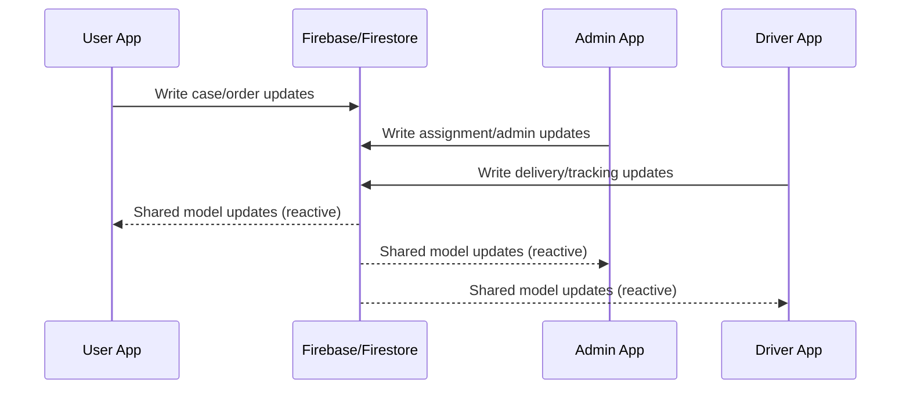

# FastCorr Shared - Technical Doc Template (Phase 3)

## Section 1 - Document Metadata
- App: `fastcorr_shared`
- Scope: Shared package stabilization during Phase 3
- Date: 2026-03-30
- Owner: [NEEDS MANUAL INPUT]

## Section 2 - Objective
- Keep shared components stable for consumer apps (`user`, `admin`, `dr`).
- Preserve existing behavior while improving test/compile reliability integration points.

## Section 3 - System Context
- Package role: shared models/services/widgets used by multiple FastCorr apps.
- This phase focused on shared communication and tracking support consistency.

## Section 4 - Architecture (Stacked + Shared Layer)
- Shared UI + ViewModel components continue to be consumed by app-specific views.
- Notable shared communication alignment:
  - `lib/ui/communication/shared_communication_widget.dart`
  - `lib/ui/communication/shared_communication_viewmodel.dart`
- Shared service touched:
  - `lib/services/map_tracking_service.dart`

## Section 5 - Data Layer
- Shared models/services remain the cross-app contract for Firestore-backed entities.
- Data contract specifics not fully derivable from this package alone: [NEEDS MANUAL INPUT]

## Section 6 - Cross-App Flows

## Section 7 - Business Logic
- Shared package business logic was not functionally rewritten in this phase.
- Stability focus:
  - communication error surfacing and UX consistency
  - map tracking service compatibility with consuming apps

## Section 8 - Platform/Runtime Compatibility
- Shared code remained platform-neutral for VM/web consumers in this phase.
- No new platform-specific branches were introduced here.

## Section 9 - File-Level Change Inventory
- `lib/services/map_tracking_service.dart`
- `lib/ui/communication/shared_communication_viewmodel.dart`
- `lib/ui/communication/shared_communication_widget.dart`
- `LICENSE` (non-runtime/legal metadata update)

## Section 10 - Edge Cases and Failure Handling
- Shared communication path now keeps explicit error-state UX behavior visible to consumers.
- Additional package-level failure matrix: [NEEDS MANUAL INPUT]

## Section 11 - Risks and Follow-Ups
- Risk: shared package behavior can regress if consuming apps diverge in adapter assumptions.
- Follow-up recommendation:
  - Add package-level contract tests for communication + tracking model interoperability.

## Section 12 - Testing
- Existing tests present under `test/`.
- Phase outcome:
  - Full `flutter test` run in `fastcorr_shared` passed.
- Suggested next tests:
  - Expand cross-package contract tests for key shared models consumed by all apps.
